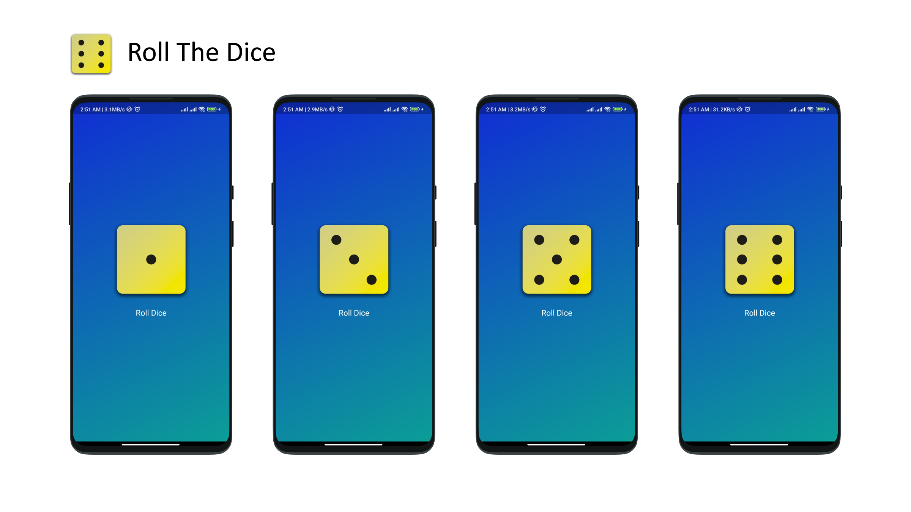

# Simple Dice Roller App

A very basic Flutter app featuring a button and a dice. On pressing the button, the dice rolls randomly, displaying a new value.

---

## 🛠️ Technologies Used

  

---

## 📱 Download APK  
Click the below button to download and test the app:

---

## Features

- A single button to roll the dice.  
- Displays a random dice value on each roll.  
- Minimalistic design for simplicity.  

---

## 🤝 Contributions

Contributions are welcome! Fork the repository, make changes, and submit a pull request.  

---

  
# 🎉 Happy Rolling! 🎉  

